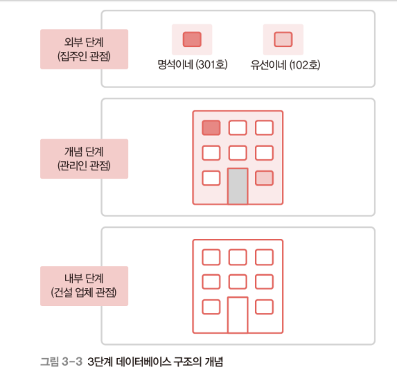

# 3 데이터베이스 시스템

## 01. 데이터베이스 시스템 정의

### 데이터베이스 시스템

데이터베이스에 데이터를 저장하고, 이를 관리해 조직에 필요한 정보를 

생성해주는 시스템 

## 02. 데이터베이스 구조

### ⭐스키마 (schema) 

- 데이터베이스에 저장되는 **데이터 구조와 제약조건 (데이터 무결성)**을 정의한 것 

### ⭐인스턴스 (instance)

- 스키마에 따라 데이터베이스에 **실제로 저장된 값 **

데이터 요소로 고객번호,이름,나이,주소로 설정하겠다. 라고 하는게 스키마

int, char , int , char 이것은  'domain'

### ⭐3단계 데이터베이스 구조

- 미국 표준화 기관인 ANSI/SPARC에서 제안

- 데이터베이스를 쉽게 이해하고 이용할 수 있도록 하나의 데이터베이 스를 관점에 따라 세 단계로 나눈 
  - 외부 단계(external level) : 개별 사용자 관점
  - 개념 단계(conceptual level) : 조직 전체의 관점⭐⭐(제일 중요!)
  - 내부 단계(internal level) : 물리적인 저장 장치의 관점
- 각 단계별로 다른 추상화(abstraction) 제공
  - 내부 단계에서 외부 단계로 갈수록 추상화 레벨 높아짐 

개념 단계 - 관리인 관점에서 보는 것 (아파트 전체 관리)

내부 단계 - 건설 업체 관점으로 뼈대 모양을 어떻게 잘 만들 것인가 ? 

외부 단계 - 집주인 관점 (자신의 집만 관심을 가지는 것)

### 3단계 데이터베이스 구조 : 외부 단계

- 데이터베이스를 개별 사용자 관점에서 이해하고 표현하는 단계

- 데이터베이스 하나에 *외부 스키마 여러개 존재 가능*

  - 외부 스키마(external schema) 

    – 외부 단계에서 사용자에게 필요한 데이터베이스를 정의한 것

     – 각 사용자가 생각하는 데이터베이스의 모습, 즉 논리적 구조로

    ​	 사용자마다 다름 

    – 서브 스키마(sub schema)라고도 함

### ⭐ 3단계 데이터베이스 구조 : 개념 단계

- 데이터베이스를 조직 전체 관점에서 이해하고 표현하는 단계

- 데이터베이스 하나에 *개념 스키마 하나만 존재* 
  -  개념 스키마(conceptual schema)

 			– 개념 단계에서 데이터베이스 전체의 논리적 구조를 정의한 것 

​			– 조직 전체의 관점에서 생각하는 데이터베이스의 모습

​			 – 전체 데이터베이스에 어떤 데이터가 저장되는지, 데이터들 간에는 				어떤 관계가 존재하고 어떤 제약조건이 있는지에 대한 정의뿐만 아				니라, 데이터에 대한 보안 정 책이나 접근 권한에 대한 정의도 포함

### 3단계 데이터베이스 구조 : 내부 단계

- 데이터베이스를 저장 장치의 관점에서 이해하고 표현하는 단계

- 데이터베이스 하나에 *내부 스키마 하나만 존재* 
  - 내부 스키마(internal schema)
    - 전체 데이터베이스가 저장 장치에 실제로 저장되는 방법을 정의한 것 
    - 레코드 구조, 필드 크기, 레코드 접근 경로 등 물리적 저장 구조를 정의

### 3단계 데이터베이스 구조의 사상 또는 매핑

#### ⭐스키마 사이 대응 관계

- 외부/개념 사상 : 외부와 개념 스키마의 대응 관계 (응용 인터페이스)

  - 개념/내부 사상 : 개념과 내부 스키마의 대응 관계 (저장 인터페이스)

#### 미리 정의된 사상 정보 이용해서 사용자가 원하는 데이터에 접근 

### ⭐데이터 독립성(data independency)

- 하위 스키마 변경해도 상위 스키마 영향 받지 않는 특성

#### 논리적 데이터 독립성

- 개념 스키마 변경되도 외부 스키마 영향 안받음
- 개념 스키마 변경되면 관련된 외부/개념 사상만 정확히 수정하면 됨

#### 물리적 데이터 독립성

- 내부 스키마 변경되도 개념 스키마 영향 안받음
- 내부 스키마 변경되면 관련된 개념/내부 사상만 정확하게 수정하면 

### ⭐데이터 사전(data dictionary)

🚨 이름과 의미를 기억해야 한다. 

= 시스템 카탈로그(system catalog) 라고도 불림

- `DB에 저장되는 데이터에 관한 정보(메타 데이터)를 유지하는 시스템 DB`
  - 메타 데이터 : 데이터에 대한 데이터
- 스키마, 사상 정보, 다양한 제약조건 등을 저장
- DB 관리 시스템이 스스로 생성하고 유지함
- `일반 사용자도 접근이 가능하지만 저장 내용을 검색만 할 수 있음`

​	-> 수정은 할 수 없음 

### 데이터 디렉터리(data directory)

- 데이터 사전에 있는 데이터에 `실제로 접근하는 데 필요한 위치 정보 저장`하는 시스템 DB
- `일반 사용자의 접근 허용이 안됨`

### 사용자 데이터베이스(user database)

- 사용자가 실제로 이용하는 데이터가 저장되어 있는 일반 DB

## ⭐ 03. 데이터베이스 사용자

- DB를 이용하기 위해 접근하는 모든 사람
- `이용 목적`에 따라 3가지로 구분됨

#### 1. DB 관리자 (DBA : Database Administrator)

- **DB시스템을 운영 및 관리하는 사람**
- `데이터 정의어 + 데이터 제어어` 이용 
- 주요 업무

| DB 구성 요소 선정                     |
| ------------------------------------- |
| **DB 스키마 정의**                    |
| **물리적 저장 구조와 접근 방법 결정** |
| **무결성 유지를 위한 제약조건 정의**  |
| **보안 및 접근 권한 정책 결정**       |
| **백업 및 회복 기법 정의**            |
| **시스템 DB 관리**                    |
| **시스템 성능 감시 및 성능 분석**     |
| **DB 재구성**                         |

#### 2. 최종 사용자(end user)

- **DB에 접근해 데이터 조작(삽입, 삭제, 수정, 검색)하는 사람**
- `데이터 조작어` 이용
- 캐주얼 사용자와 초보 사용자로 구분

#### 3. 응용 프로그래머(application programmer)

- **데이터 언어를 삽입해 응용 프로그램을 작성하는 사람**
- `데이터 조작어` 이용

## ⭐ 04. 데이터 언어

**사용자와 DB 관리 시스템 간 통신 수단**

`사용 목적`에 따라 3가지로 분류

#### 1. 데이터 정의어(DDL : Data Definition Language)

- `스키마 정의`하거나, `수정 또는 삭제`하기 위해 사용 
- 주로 DB 관리자가 사용

#### 2. 데이터 조작어(DML : Data Manipulation Language)

- 데이터 삽입, 삭제, 수정, 검색 등의 처리를 요구하기 위해 사용
  - ⭐ 절차적 데이터 조작어(procedural DML)
    - 사용자가 어떤(What) 데이터를 원하고 그 데이터를 얻기 위해 어떻게(How) 처리해야 하는지도 설명
  - ⭐ 비절차적 데이터 조작어(nonprocedural DML)
    - 사용자가 어떤(What) 데이터를 원하는지만 설명
    - 선언적 언어라고도 함 

#### 3. 데이터 제어어(DCL : Data Control Language)

- 내부적으로 필요한 규칙이나 기법을 정의하기 위해 사용
- 사용 목적

| 무결성          | 정확하고 유효한 데이터만 유지                                |
| --------------- | ------------------------------------------------------------ |
| **보안**        | **허가받지 않은 사용자의 데이터 접근 차단, 허가된 사용자에 권한 부여** |
| **회복**        | **장애가 발생해도 데이터 일관성 유지**                       |
| **동시성 제어** | **동시 공유 지원**                                           |

은행은 송금하는 사람이 많아도 동시성 제어를 통해 정확하게 돈을 송금할 수 있음 

## 05. 데이터베이스 관리 시스템 구성

데이터베이스 관리와 사용자의 데이터 처리 요구 수행 

▪ 주요 구성 요소

​	 • 질의 처리기(query processor) 

​		– 사용자의 데이터 처리 요구를 해석하여 처리 

​		– DDL 컴파일러, DML 프리 컴파일러, DML 컴파일러, 런타임 데이터베이스 처리기, 		   트랜잭션 관리자 등을 포함

​	 • 저장 데이터 관리자(stored data manager)

​		 – 디스크에 저장된 데이터베이스와 데이터 사전을 관리하고 접근함

