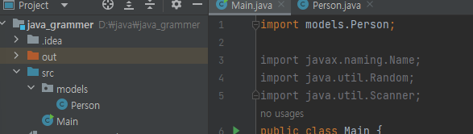

# 1. 패키지, import

`models`라는 패키지를 만들어 클래스를 선언해 Main class에서 사용하는 방법에 대해 알아보자

Person 클래스는 앞과 동일한 코드임

앞에서는 Main.java에 코드를 같이 적어서 import를 할 필요가 없었지만 

외부의 java코드를 Main.java에서도 사용하기 위해선 `import [패키지이름].[.java이름]`을 선언해야 한다.

# 2. 상속

`Person`이라는 클래스에서 기능을 추가해보자

